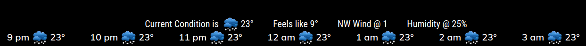

## MMM-Climacell-Hourly

* Hourly weather module using the NEW Climacell v4 api

* You will need a new API key from Climacell

## Good-bye bottom_bar (Well, not really)

* This was designed for use in the bottom_bar position of your MagicMirror
* Can share bottom bar position with any module via Hello-Lucy
* Five minute updates for current conditions
* CSS provided for coloring and sizing. Make it your own.

## Examples

* Default white



## Installation and requirements

* `git clone https://github.com/mykle1/MMM-Climacell-Hourly` into the `~/MagicMirror/modules` directory.

* Free API key at `https://www.climacell.co` (Required)

* No dependencies needed! No kidding!

## Config.js entry and options

```
{
    disabled: false,
    module: "MMM-Climacell-Hourly",
    position: "bottom_bar", // designed for bottom_bar(best) thirds should be good too
    config: {
        apiKey: "Your API key", // Get FREE API key from ClimaCell.com
        ownTitle: "Current Condition is ",
        tempUnits: "imperial", // imperial or metric
        lat: '41.7749', // Chicago
        lon: '-87.4194', // Chicago
        css: "2",
        playSounds: "no",
        useHeader: false, // true if you want a header
        header: "Your header",
        maxWidth: "100%",
        updateInterval: 5 * 60 * 1000,
    }
},
```

## Thanks to @cowboysdude for perpetual tech support!
